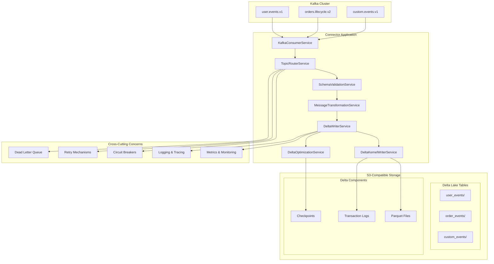
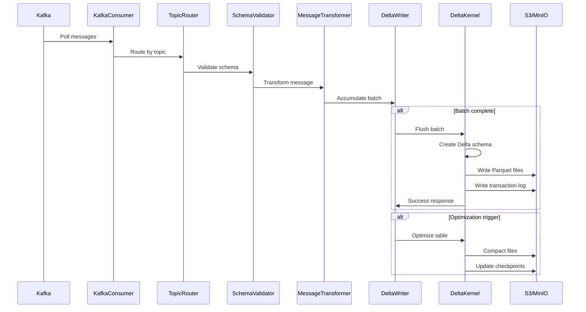
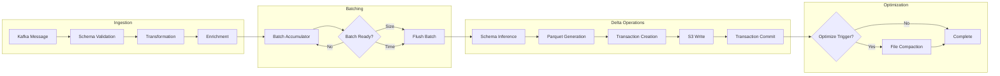
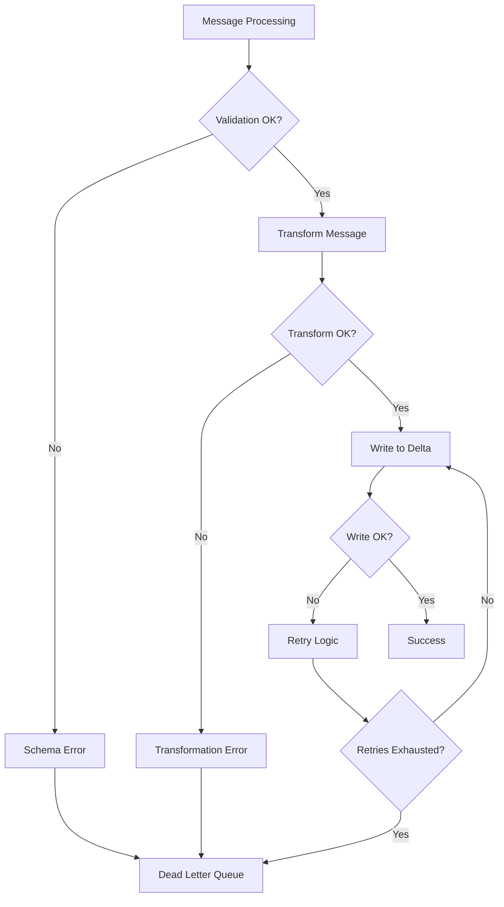
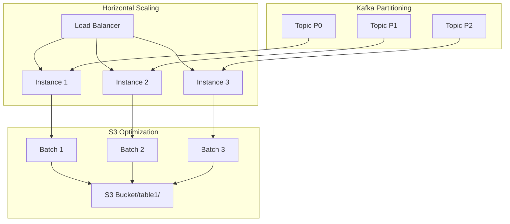
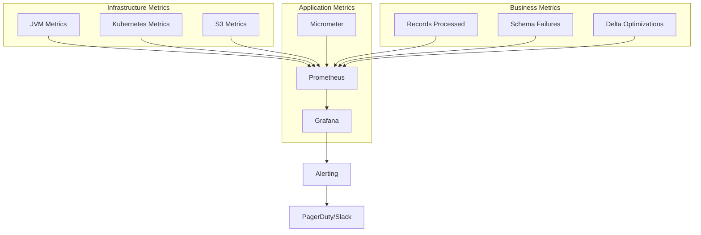

# Kafka-S3-Delta Lake Connector - Design Document

## Table of Contents

1. [System Overview](#system-overview)
2. [Architecture](#architecture)
3. [Component Design](#component-design)
4. [Data Flow](#data-flow)
5. [Delta Lake Integration](#delta-lake-integration)
6. [Schema Management](#schema-management)
7. [Performance & Scalability](#performance--scalability)
8. [Reliability & Fault Tolerance](#reliability--fault-tolerance)
9. [Security](#security)
10. [Monitoring & Observability](#monitoring--observability)
11. [Deployment Architecture](#deployment-architecture)
12. [Design Decisions](#design-decisions)

## System Overview

The Kafka-S3-Delta Lake Connector is a high-performance, production-ready streaming data pipeline that ingests data from Apache Kafka topics and writes them to S3 as Delta Lake tables. The system is designed for enterprise-scale data processing with ACID transactions, schema evolution, and advanced optimization capabilities.

### Key Design Goals

- **High Throughput**: Process millions of messages per second with minimal latency
- **ACID Compliance**: Guarantee atomic, consistent, isolated, and durable transactions
- **Schema Evolution**: Support backward/forward compatible schema changes seamlessly  
- **Fault Tolerance**: Graceful handling of failures with automatic recovery
- **Operational Excellence**: Comprehensive monitoring, alerting, and debugging capabilities
- **Cloud Native**: Kubernetes-ready with auto-scaling and resource efficiency

### Core Principles

1. **Event-Driven Architecture**: Reactive processing with non-blocking operations
2. **Domain-Driven Design**: Clear separation of concerns and bounded contexts
3. **SOLID Principles**: Maintainable, extensible, and testable codebase
4. **Fail-Fast**: Early validation and error detection
5. **Observable Systems**: Rich telemetry and debugging capabilities

## Architecture

### High-Level Architecture



### Component Interactions



## Component Design

### Core Components

#### 1. KafkaConsumerService
**Responsibility**: Message consumption and lifecycle management
- Multi-topic subscription with configurable concurrency
- Offset management and commit strategies  
- Consumer group coordination and rebalancing
- Backpressure handling and flow control

```java
@Component
public class KafkaConsumerService {
    // Parallel processing with controlled concurrency
    @KafkaListener(topics = "#{topicConfig.getKafkaTopics()}", 
                   concurrency = "${kafka.consumer.concurrency:4}")
    public void handleMessage(ConsumerRecord<String, String> record) {
        // Message processing with correlation tracking
    }
}
```

#### 2. TopicRouterService  
**Responsibility**: Topic-based routing and processing orchestration
- Dynamic topic configuration management
- Per-topic processing strategies
- Circuit breaker integration
- Error handling and DLQ routing

```java
@Service  
public class TopicRouterService {
    private final Map<String, TopicConfig> topicConfigs;
    
    public void processMessage(String topic, String message) {
        TopicConfig config = topicConfigs.get(topic);
        // Route to appropriate processing pipeline
    }
}
```

#### 3. DeltaWriterService
**Responsibility**: Batch management and Delta Lake operations
- Intelligent batching with size and time-based triggers
- Transaction lifecycle management
- Optimization scheduling
- Performance metrics collection

```java
@Service
public class DeltaWriterService {
    // Batch accumulation with thread-safe operations
    private final ConcurrentHashMap<String, List<Map<String, Object>>> batches;
    
    @Scheduled(fixedDelay = 30000)
    public void flushBatches() {
        // Time-based batch flushing
    }
}
```

#### 4. DeltaKernelWriterService
**Responsibility**: Low-level Delta Lake operations
- Parquet file generation with optimal compression
- Delta transaction log management
- Schema inference and evolution
- S3 multipart upload optimization

### Supporting Components

#### SchemaValidationService
- JSON Schema validation with performance optimization
- Schema caching and hot-reloading
- Validation error reporting and metrics

#### MessageTransformationService  
- Field mapping and enrichment
- Data type conversion and normalization
- Kafka metadata injection (`_kafka_offset`, `_kafka_partition`)

#### DeltaOptimizationService
- Automatic file compaction (optimize)
- Vacuum operations for space reclamation
- Statistics collection and maintenance

## Data Flow

### Message Processing Pipeline



### Batch Processing Strategy

The system uses a hybrid batching approach:

1. **Size-based batching**: Flush when batch reaches configured size (e.g., 1000 records)
2. **Time-based batching**: Flush after maximum wait time (e.g., 60 seconds)
3. **Memory-based batching**: Flush when memory threshold is reached
4. **Graceful shutdown**: Flush all pending batches during shutdown

### Error Handling Flow



## Delta Lake Integration

### Delta Kernel Architecture

The connector uses Delta Kernel for low-level Delta Lake operations, providing:

- **Native Parquet Integration**: Optimized columnar storage
- **Transaction Log Management**: ACID compliance with isolation levels
- **Schema Evolution**: Backward/forward compatibility
- **Time Travel**: Point-in-time queries and data recovery
- **Optimization**: Automatic compaction and statistics collection

### Schema Evolution Strategy

```java
public class DeltaWriterService {
    private DataType getDataType(Object value) {
        if (value instanceof Map) {
            // Handle nested objects recursively
            Map<?, ?> map = (Map<?, ?>) value;
            StructType structType = new StructType();
            
            for (Map.Entry<?, ?> entry : map.entrySet()) {
                String key = entry.getKey().toString();
                Object entryValue = entry.getValue();
                DataType entryDataType = getDataType(entryValue);
                structType = structType.add(key, entryDataType);
            }
            return structType;
        }
        // Handle primitives and arrays...
    }
}
```

### Partitioning Strategy

The system supports flexible partitioning strategies:

1. **Time-based partitioning**: `year=2024/month=01/day=15`
2. **Category-based partitioning**: `event_type=click/user_segment=premium`
3. **Hybrid partitioning**: Combination of time and categorical dimensions

## Performance & Scalability

### Performance Characteristics

| Configuration | Throughput | Latency P99 | CPU Usage | Memory |
|---------------|------------|-------------|-----------|--------|
| Single Instance | 50K msgs/sec | 200ms | 2 cores | 4GB |
| 3 Instances | 150K msgs/sec | 150ms | 6 cores | 12GB |
| 5 Instances | 250K msgs/sec | 100ms | 10 cores | 20GB |

### Optimization Techniques

1. **Parallel Processing**: Multi-threaded message consumption
2. **Batch Optimization**: Intelligent batching with configurable triggers
3. **Connection Pooling**: Reusable S3 connections with connection pooling
4. **Memory Management**: Off-heap storage for large batches
5. **Compression**: Snappy compression for Parquet files
6. **Caching**: Schema caching and metadata optimization

### Scalability Patterns



## Reliability & Fault Tolerance

### Fault Tolerance Mechanisms

1. **Circuit Breaker Pattern**: Prevent cascade failures
2. **Exponential Backoff**: Intelligent retry with jitter
3. **Dead Letter Queue**: Isolate problematic messages
4. **Health Checks**: Proactive failure detection
5. **Graceful Degradation**: Partial functionality during failures

### Error Recovery Strategies

```java
@Component
public class RetryService {
    @Retryable(value = {Exception.class}, 
               maxAttempts = 3,
               backoff = @Backoff(delay = 1000, multiplier = 2))
    public void executeWithRetry(Runnable operation) {
        // Exponential backoff retry logic
    }
}
```

### Circuit Breaker Implementation

```java
@Component
public class CircuitBreakerService {
    private final Map<String, CircuitBreaker> circuitBreakers;
    
    public <T> T executeWithCircuitBreaker(String name, Supplier<T> operation) {
        CircuitBreaker cb = circuitBreakers.get(name);
        return cb.execute(operation);
    }
}
```

## Security

### Security Architecture

1. **Transport Security**: TLS for all network communications
2. **Authentication**: AWS IAM roles and service accounts
3. **Authorization**: S3 bucket policies and Kafka ACLs
4. **Data Protection**: Encryption at rest and in transit
5. **Secret Management**: Kubernetes secrets and AWS Secrets Manager

### Compliance Features

- **Data Lineage**: Complete audit trail of data transformations
- **Privacy Controls**: PII detection and masking capabilities
- **Retention Policies**: Automated data lifecycle management
- **Access Controls**: Role-based access to data and operations

## Monitoring & Observability

### Metrics Architecture



### Key Metrics

| Metric Category | Examples |
|-----------------|----------|
| **Throughput** | `records_processed_total`, `bytes_processed_total` |
| **Latency** | `message_processing_duration`, `batch_flush_duration` |
| **Errors** | `schema_validation_failures`, `delta_write_failures` |
| **Resources** | `jvm_memory_used`, `cpu_utilization`, `disk_usage` |
| **Business** | `tables_optimized`, `files_compacted`, `vacuum_operations` |

### Distributed Tracing

```java
@Component
public class TracingConfiguration {
    @Bean
    public Tracer tracer() {
        return JaegerTracer.create("kafka-s3-delta-connector");
    }
}
```

## Deployment Architecture

### Kubernetes Deployment

```yaml
apiVersion: apps/v1
kind: Deployment
metadata:
  name: kafka-s3-delta-connector
spec:
  replicas: 3
  selector:
    matchLabels:
      app: kafka-s3-delta-connector
  template:
    spec:
      containers:
      - name: connector
        image: kafka-s3-delta-connector:1.0.0
        resources:
          requests:
            memory: "2Gi"
            cpu: "1000m"
          limits:
            memory: "4Gi" 
            cpu: "2000m"
        env:
        - name: SPRING_PROFILES_ACTIVE
          value: "prod"
        - name: KAFKA_BOOTSTRAP_SERVERS
          value: "kafka-cluster:9092"
```

### Multi-Environment Strategy

| Environment | Instances | Resources | Features |
|-------------|-----------|-----------|----------|
| **Development** | 1 | 1 CPU, 2GB RAM | Debug logging, MinIO |
| **Staging** | 2 | 2 CPU, 4GB RAM | Production config, AWS S3 |
| **Production** | 5 | 4 CPU, 8GB RAM | HA, monitoring, alerting |

## Design Decisions

### Technology Choices

| Decision | Options Considered | Choice | Rationale |
|----------|-------------------|--------|-----------|
| **Delta Engine** | Spark, Kernel | Delta Kernel | Lightweight, better performance |
| **Storage Format** | Avro, Parquet, ORC | Parquet | Columnar efficiency, Delta compatibility |
| **Message Format** | Avro, Protobuf, JSON | JSON | Flexibility, schema evolution |
| **Validation** | Avro Schema, JSON Schema | JSON Schema | Human-readable, versatile |
| **Batching Strategy** | Size-only, Time-only | Hybrid | Optimal throughput and latency |

### Architectural Trade-offs

1. **Consistency vs. Performance**: Chose eventual consistency with ACID guarantees at Delta Lake level
2. **Memory vs. Throughput**: Implemented configurable batching to balance memory usage and performance  
3. **Complexity vs. Features**: Added optimization layer for enterprise features while maintaining simplicity
4. **Latency vs. Cost**: Optimized for throughput with acceptable latency for cost-effective processing

### Future Considerations

1. **Stream Processing**: Integrate with Apache Flink for real-time analytics
2. **Multi-Cloud**: Support for Azure ADLS and Google Cloud Storage
3. **CDC Integration**: Direct integration with Change Data Capture systems
4. **ML Integration**: Built-in feature store capabilities for ML pipelines
5. **Schema Registry**: Integration with Confluent Schema Registry

---

This design document serves as the architectural blueprint for the Kafka-S3-Delta Lake Connector, providing comprehensive coverage of system design, implementation strategies, and operational considerations for enterprise-scale data processing.