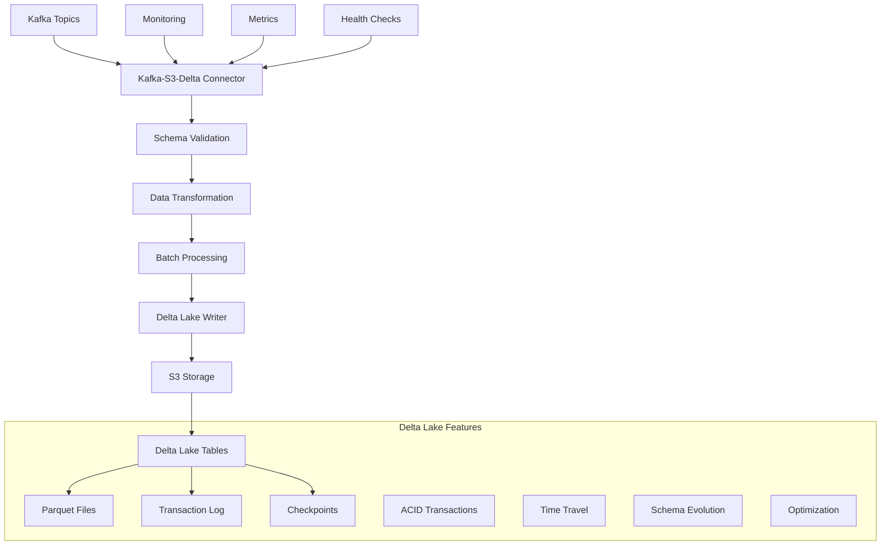

# Kafka-S3-Delta Lake Connector

> **Production-ready Kafka connector that streams data to S3 as Delta Lake tables with schema evolution, ACID transactions, and advanced optimization.**

[](https://github.com/gauravsri/Kafka-s3-connector/releases)
[](LICENSE)
[](https://openjdk.org/)
[](https://spring.io/projects/spring-boot)
[](https://delta.io/)

## 🚀 Overview

The Kafka-S3-Delta Lake Connector is a simplified, high-performance solution that streams data from Apache Kafka topics directly to S3 as Delta Lake tables. **Now featuring Kafka-native idempotency** that eliminates complex database dependencies while maintaining exactly-once processing guarantees.

### ✨ Key Features

- **🚀 Simplified Architecture**: Kafka-native offset management eliminates database complexity
- **🏗️ Delta Lake Integration**: Native Delta Lake tables with ACID transactions and schema evolution  
- **⚡ High Performance**: No database lookups or bloom filters - pure Kafka Consumer Groups
- **🔄 Multi-Format Support**: JSON, CSV, and Avro message parsing with unified processing
- **📊 COB Partitioning**: Close-of-Business date partitioning for analytics workloads
- **🔍 Data Quality**: Business rule validation and deterministic data enrichment
- **📈 Production Ready**: Retry policies, dead letter queues, and comprehensive monitoring
- **🛡️ Reliability**: Exactly-once processing via Kafka offset management + idempotent business logic
- **🐳 Cloud Native**: Zero external dependencies beyond Kafka and S3
- **⚙️ Natural Idempotency**: Delta Lake's append-only nature prevents duplicate processing

## 🏗️ Architecture



### 🛠️ Technology Stack

| Component | Technology | Version |
|-----------|------------|---------|
| **Runtime** | Spring Boot | 3.2+ |
| **Delta Engine** | Delta Kernel | 4.0.0 |
| **Storage** | Apache Hadoop S3A | 3.3.6 |
| **Messaging** | Apache Kafka | 3.6+ |
| **Data Format** | Apache Parquet | Latest |
| **Schema** | JSON Schema Validator | Latest |
| **Monitoring** | Micrometer + Prometheus | Latest |
| **Build** | Apache Maven | 3.9+ |
| **Java** | OpenJDK | 17+ |

## 🚀 Quick Start

### Prerequisites

- **Java 17+** with JAVA_HOME configured
- **Apache Maven 3.9+** for building
- **Docker & Docker Compose** for local infrastructure
- **S3-compatible storage** (AWS S3 or MinIO for local development)
- **Apache Kafka** (or RedPanda for local development)

### 1. Local Development Setup

```bash
# Clone the repository
git clone https://github.com/gauravsri/Kafka-s3-connector.git
cd Kafka-s3-connector

# Start local infrastructure (RedPanda + MinIO)
docker-compose up -d

# Verify services are running
docker-compose ps
```

### 2. Build and Run

```bash
# Build the connector
mvn clean package -DskipTests

# Run locally
java -jar target/kafka-s3-connector-1.0.0-SNAPSHOT.jar

# Or with Maven
mvn spring-boot:run
```

### 3. Verify Setup

```bash
# Check connector health
curl http://localhost:8081/actuator/health

# View metrics
curl http://localhost:8081/actuator/metrics

# Access MinIO console
open http://localhost:9001  # minioadmin/minioadmin
```

### 4. Test with Sample Data

```bash
# Publish test user event
echo '{
  "user_id": "user123",
  "event_type": "view",
  "timestamp": "2024-01-15T10:30:00Z",
  "page_url": "https://example.com/product/1",
  "session_id": "session456",
  "properties": {
    "category": "electronics",
    "price": 99.99,
    "metadata": {"campaign": "summer_sale"}
  }
}' | docker exec -i $(docker-compose ps -q redpanda) rpk topic produce user.events.v1

# Publish test order event  
echo '{
  "order_id": "order789", 
  "customer_id": "customer123",
  "order_status": "created",
  "timestamp": "2024-01-15T10:30:00Z",
  "total_amount": 299.99,
  "currency": "USD",
  "items": [
    {
      "product_id": "prod1",
      "quantity": 2, 
      "unit_price": 149.99
    }
  ]
}' | docker exec -i $(docker-compose ps -q redpanda) rpk topic produce orders.lifecycle.v2
```

### 5. Verify Delta Lake Tables

```bash
# List created tables in S3
docker exec minio mc ls minio/data-lake/ --recursive

# View Delta transaction log
docker exec minio mc cat minio/data-lake/events/user-events/_delta_log/00000000000000000000.json
```

## 📋 Configuration

### Environment Variables

| Variable | Description | Default | Example |
|----------|-------------|---------|---------|
| `KAFKA_BOOTSTRAP_SERVERS` | Kafka brokers | `localhost:9092` | `kafka1:9092,kafka2:9092` |
| `AWS_S3_ENDPOINT` | S3 endpoint URL | `http://localhost:9000` | `https://s3.amazonaws.com` |
| `AWS_S3_BUCKET` | Target bucket | `data-lake` | `production-data-lake` |
| `AWS_ACCESS_KEY_ID` | AWS access key | `minioadmin` | `AKIA...` |
| `AWS_SECRET_ACCESS_KEY` | AWS secret key | `minioadmin` | `...` |
| `AWS_REGION` | AWS region | `us-east-1` | `us-west-2` |

### Topic Configuration

Configure Delta Lake destinations in `application.yml`:

```yaml
connector:
  topics:
    user-events:
      kafka-topic: "user.events.v1"
      schema-file: "schemas/user-events-schema.json"
      destination:
        bucket: "data-lake"
        path: "events/user-events"
        partition-columns: ["year", "month", "day", "event_type"]
        table-name: "user_events"
        delta-config:
          enable-optimize: true
          optimize-interval: 10
          enable-schema-evolution: true
          enable-vacuum: false
      processing:
        batch-size: 1000
        flush-interval: 60
        max-retries: 3
```

### Schema Definition

Define JSON schemas in `src/main/resources/schemas/`:

```json
{
  "$schema": "http://json-schema.org/draft-04/schema#",
  "type": "object",
  "title": "User Events Schema", 
  "required": ["user_id", "event_type", "timestamp"],
  "properties": {
    "user_id": {"type": "string"},
    "event_type": {"type": "string", "enum": ["click", "view", "signup"]},
    "timestamp": {"type": "string", "format": "date-time"},
    "page_url": {"type": "string", "format": "uri"},
    "session_id": {"type": "string"},
    "properties": {
      "type": "object",
      "additionalProperties": true
    }
  },
  "additionalProperties": false
}
```

## 🔄 Delta Lake Features

### ACID Transactions

Every write to Delta Lake is atomic, consistent, isolated, and durable:

```bash
# View transaction history
docker exec minio mc cat minio/data-lake/events/user-events/_delta_log/00000000000000000000.json | jq .
```

### Schema Evolution  

The connector automatically handles schema changes:

```yaml
delta-config:
  enable-schema-evolution: true  # Allow new columns
  enable-optimize: true          # Automatic optimization
  checkpoint-interval: "10"      # Checkpoint every 10 commits
```

### Time-Based Partitioning

Optimize queries with intelligent partitioning:

```yaml
partition-columns: ["year", "month", "day", "event_type"]
```

This creates directory structure:
```
s3://data-lake/events/user-events/
├── year=2024/month=01/day=15/event_type=view/
├── year=2024/month=01/day=15/event_type=click/  
└── year=2024/month=01/day=16/event_type=signup/
```

### Optimization & Maintenance

```yaml
delta-config:
  enable-optimize: true         # Compact small files
  optimize-interval: 10         # Optimize every 10 commits
  enable-vacuum: true           # Clean old files
  vacuum-retention-hours: 168   # Keep 7 days of history
```

## 📊 Monitoring & Operations

### Health Checks

```bash
# Overall health
curl http://localhost:8081/actuator/health

# Detailed component health
curl http://localhost:8081/actuator/health | jq '.components'
```

### Metrics

| Metric | Description | Type |
|--------|-------------|------|
| `kafka_connector_records_processed_total` | Total records processed | Counter |
| `kafka_connector_delta_writes_total` | Delta Lake writes | Counter |
| `kafka_connector_batch_flush_duration` | Batch processing time | Timer |
| `kafka_connector_schema_validation_failures` | Schema validation failures | Counter |
| `kafka_connector_optimization_runs_total` | Table optimization runs | Counter |

### Logging

Structured JSON logging with correlation IDs:

```json
{
  "timestamp": "2024-01-15T10:30:00.123Z",
  "level": "INFO", 
  "logger": "DeltaWriterService",
  "correlationId": "abc-123-def",
  "topic": "user.events.v1",
  "message": "Successfully wrote batch to Delta Lake: user_events",
  "batch_size": 1000,
  "processing_time_ms": 250
}
```

## 🧪 Testing

### Unit Tests

```bash
# Run all unit tests
mvn test

# Run specific test class
mvn test -Dtest=DeltaWriterServiceTest

# Run with coverage
mvn test jacoco:report
```

### Integration Tests

```bash
# Start test infrastructure
docker-compose up -d

# Run integration tests
mvn test -Dtest="*IntegrationTest"

# End-to-end pipeline test  
mvn test -Dtest=EndToEndPipelineTest
```

### Load Testing

```bash
# Generate test data
./scripts/generate-test-load.sh 10000

# Monitor processing
watch -n 1 'curl -s http://localhost:8081/actuator/metrics/kafka.connector.records.processed.total | jq .'
```

## 🚀 Production Deployment

### Docker

```bash
# Build Docker image
docker build -t kafka-s3-delta-connector:1.0.0 .

# Run with production config
docker run -d \
  -e SPRING_PROFILES_ACTIVE=prod \
  -e KAFKA_BOOTSTRAP_SERVERS=kafka1:9092,kafka2:9092 \
  -e AWS_S3_BUCKET=production-data-lake \
  kafka-s3-delta-connector:1.0.0
```

### Kubernetes

```bash
# Deploy to staging
kubectl apply -k k8s/overlays/staging

# Deploy to production  
kubectl apply -k k8s/overlays/prod

# Check deployment
kubectl get pods -n kafka-s3-connector
kubectl logs -f deployment/kafka-s3-connector -n kafka-s3-connector
```

## 📈 Performance Tuning

### Batch Configuration

```yaml
processing:
  batch-size: 5000      # Records per batch
  flush-interval: 30    # Max seconds before flush
  max-retries: 3        # Retry attempts
```

### JVM Settings

```bash
export JAVA_OPTS="-Xmx4g -Xms2g -XX:+UseG1GC -XX:MaxGCPauseMillis=200"
```

### S3 Optimization

```yaml
aws:
  s3:
    path-style-access: true
    multipart-threshold: 64MB
    multipart-part-size: 32MB 
    max-connections: 50
```

## 🔧 Troubleshooting

### Common Issues

**Schema Validation Failures**
```bash
# Check schema files
find src/main/resources/schemas/ -name "*.json" -exec cat {} \;

# Validate JSON schema syntax
cat schemas/user-events-schema.json | jq empty
```

**Delta Lake Write Errors** 
```bash
# Check S3 connectivity
aws s3 ls s3://data-lake/ --endpoint-url http://localhost:9000

# Verify Delta transaction logs
docker exec minio mc cat minio/data-lake/events/user-events/_delta_log/
```

**Performance Issues**
```bash
# Monitor JVM memory
curl http://localhost:8081/actuator/metrics/jvm.memory.used

# Check batch processing metrics  
curl http://localhost:8081/actuator/metrics/kafka.connector.batch.flush.duration
```

### Debug Mode

```bash
# Enable debug logging
export LOGGING_LEVEL_COM_COMPANY_KAFKACONNECTOR=DEBUG

# View detailed processing logs
tail -f logs/kafka-s3-connector.log | jq .
```

## 🤝 Contributing

1. Fork the repository
2. Create a feature branch: `git checkout -b feature/delta-lake-enhancement` 
3. Make your changes with tests
4. Run the test suite: `mvn test`
5. Commit with conventional commits: `git commit -m "feat: add Delta Lake optimization"`
6. Push and create a Pull Request

### Development Guidelines

- Follow [Conventional Commits](https://www.conventionalcommits.org/)
- Write comprehensive tests (unit + integration)
- Update documentation for new features  
- Ensure all CI checks pass
- Add appropriate logging and metrics

## 📄 License

This project is licensed under the Apache License 2.0 - see the [LICENSE](LICENSE) file for details.

## 🏷️ Changelog

### v1.0.0 (2024-01-15)
- ✨ Initial production release
- 🚀 Delta Lake integration with ACID transactions  
- ⚡ High-performance batch processing
- 📊 Schema evolution and complex nested object support
- 🔍 Comprehensive monitoring and observability
- 🐳 Kubernetes deployment with multi-environment support

## 📚 Documentation

- **[User Guide](USER_GUIDE.md)** - Complete setup and usage instructions
- **[Design Document](DESIGN.md)** - Architecture and design decisions  
- **[Reliability Guarantees](RELIABILITY.md)** - Message processing and fault tolerance
- **[Contributing Guidelines](CONTRIBUTING.md)** - Development and contribution guide

## 📞 Support

- **Issues**: [GitHub Issues](https://github.com/gauravsri/Kafka-s3-connector/issues)
- **Discussions**: [GitHub Discussions](https://github.com/gauravsri/Kafka-s3-connector/discussions)
- **Documentation**: [Project Wiki](https://github.com/gauravsri/Kafka-s3-connector/wiki)

---

**Built with ❤️ for the Data Engineering Community**

*High-Performance Kafka-S3-Delta Connector • Production Ready • ACID Transactions • Schema Evolution*